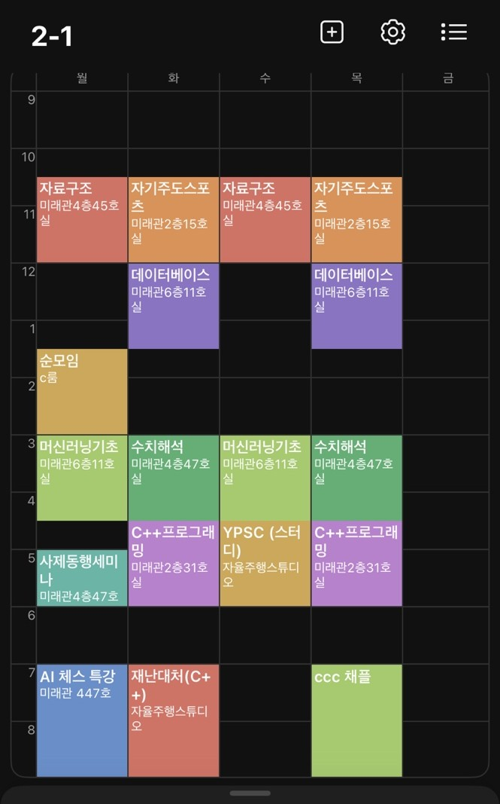

## 2025

**2025년도에 나에게 일어나는 모든 일**

  
자기소개

   # 이름 : 김영광 
  # 학교 : 국민대학교 
  # 학과 : 소프트웨어학부 
  # 학번 : 20243033 (2학년) 
  백준 계정 : https://solved.ac/profile/rladudrhkd9563

  
시간표

  

  
동아리 

  # CCC (Campus Crusade for Christ)  
  - *예배 환영부*  
  
    활동(activity)  
  - 순모임  
  - 채플  
 
  #KPSC (Kookmin Problem Solving Club)  
  - *KPSC 운영부 차장*  
  
    활동(activity) 
  - gold challenge  
  - 체스 AI 강화학습 특강 (KPSC&AIM)  
  - 국민대학교X중앙대학교 연합 프로그래밍 대회 (예정)  
  - 국숭전 개최 (예정)  
   
  #KRAFT(예정)  
  

  
관심 목표
  
  
  1. 자격증  
  - 디지털포렌식 2급 자격증  
  - 운전면허 1종  
  - 네트워크 관리사 2급  
  - SQLD 자격증  
  - 정보처리기능사  
  
  2. 가고 싶은 직종  
  - 현대 Security Engineering  
  - 모의해킹 & 해커  
  
